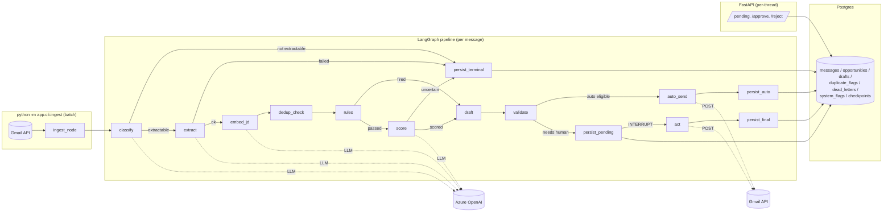

# Recruiter email triage agent

Reads recruiter email out of Gmail. Extracts structured opportunity
data. Applies deterministic filters. Scores fit against a candidate
profile. Drafts a reply. Routes to a human for approval — except when
a hard-coded rule fires a decline, in which case it may auto-send
without asking. Every outbound action is halt-able from a single DB
row without a redeploy.

This is a **learning-oriented** codebase: comments teach, decisions
are logged in `DECISIONS.md` with rejected alternatives, and the code
is organised so a reader can trace what happens by reading `graph.py`
alone. The stack is Python 3.11+, FastAPI, LangGraph, PostgreSQL
with pgvector, and Azure OpenAI.

---

## Architecture



Two entry points share the DB and the checkpointer:

- `app/cli/ingest.py` — batch: fetch → run each message through the
  graph until it either terminates or pauses at the interrupt.
- `app/api/main.py` — FastAPI: list awaiting-approval threads, accept
  approve/reject, resume the paused graph.

The graph is compiled with `PostgresSaver` as the checkpointer and
`interrupt_before=["act"]`. When a thread pauses, the whole state is
on disk in Postgres — resumption survives process restart across
either entry point.

---

## Trust boundary

Recruiter email is untrusted content. Everything in this codebase is
organised around a single question: *what can that content cause the
system to do?*

- **D13** — LLM-facing modules (`classify`, `extract`, `fit-score`,
  `embed_jd`) call a single surface, `LLMClient.structured_completion`
  or `.embed`. Neither method accepts `tools=`, function-calling, or
  any callable arguments. A prompt-injection payload in an email
  cannot cause an HTTP call, a shell exec, a DB write, or a filesystem
  touch, because the LLM's output shape is `str/int/enum → BaseModel`.
  Verified by red-team tests in `tests/red_team/`.
- **D24** — The embedding surface inherits the same guarantee. A
  malicious JD text can only cause a vector to be returned.
- **D14** — Every outbound draft passes the deterministic validator
  (`app/drafts/validator.py`): PAN/Aadhaar patterns cause quarantine;
  length exceeding config causes quarantine. The validator is code,
  not a prompt. Rejection is loud (quarantined status), never silent
  redaction.
- **D33** — Autonomy is granted by the intersection of five
  code-level gates: rule-fired, decline-type, validator-clean, no fit
  score, no duplicate flag. All gates deterministic; none depend on
  LLM confidence.
- **D36** — Kill switch: a single DB row, read before every outbound
  Gmail call. `UPDATE system_flags SET value=true WHERE
  key='sends_halted'` halts the next attempted send with no
  redeploy, no cache warmup, no process restart.

---

## Setup

```bash
# 1. Environment
cp .env.example .env                # fill in Azure keys, DB URLs
cp candidate.toml.example candidate.toml   # edit your profile
pip install -e "."                  # note the quotes on Windows

# 2. Database
docker compose up -d db             # or use an existing pgvector container
python -m alembic upgrade head       # applies migrations 0001..0005

# 3. Gmail OAuth (first run only)
# Download credentials.json from Google Cloud Console (OAuth Desktop app).
# First ingest launches the consent flow in a browser.

# 4. First run
python -m app.cli.ingest             # fetches + processes
python -m app.api.main               # http://127.0.0.1:8000/pending
```

Environment variables (see `.env.example`):

| var | required | purpose |
| --- | --- | --- |
| `DATABASE_URL` | yes | Primary Postgres connection |
| `AZURE_OPENAI_ENDPOINT` / `_API_KEY` / `_DEPLOYMENT` | yes | Chat completions |
| `AZURE_OPENAI_EMBEDDING_DEPLOYMENT` | if `DEDUP_ENABLED=true` | Embeddings deployment name |
| `DEDUP_ENABLED` | no (default true) | Toggles Phase 4 dedup nodes |
| `TEST_DATABASE_URL` | for DB tests | Sibling DB pytest uses |

---

## Everyday commands

| command | what it does |
| --- | --- |
| `python -m app.cli.ingest` | Batch: fetch + process. Prints run summary. |
| `python -m app.api.main` | Start FastAPI; approve/reject at `/pending`. |
| `python -m app.cli.report --latest` | Human-readable summary of the last run. |
| `python -m app.cli.digest` | 24-hour digest: auto-sends, waiting, dead-letters, cost. |
| `python -m app.cli.digest --hours 168 --auto-file` | Weekly digest, save to `logs/digest-YYYY-MM-DD.txt`. |
| `python -m app.cli.halt --on --by "ops"` | Halt all outbound Gmail action. |
| `python -m app.cli.halt --off --by "ops"` | Resume outbound. |
| `python -m app.cli.halt --status` | Read current halt state. |
| `python -m pytest` | Non-DB tests. DB tests skip unless `TEST_DATABASE_URL` is set. |

---

## Evaluation numbers

**Honest caveat:** Phase 3 in the original plan was a formal evaluation
harness (labelled corpus, scorecard per node, drift tracking). It was
**not built** in this repository — the build jumped from Phase 2 to
Phase 4 (dedup) to Phase 5 (autonomy). The numbers below are what can
be reported *without* that harness:

| surface | number | source | caveat |
| --- | --- | --- | --- |
| classify accuracy on seed set | see `tests/test_extract.py` fixtures | unit tests | ~15 hand-labelled messages, not a corpus |
| rule engine correctness | 100 % on `tests/test_rules.py` | 20+ cases per rule | rules are deterministic; test coverage is the metric |
| dedup calibration | *not calibrated* | Phase 4 step 5 pending | `similarity_threshold = 0.85` is a **placeholder** in `candidate.toml`; run `bench/dedup/calibrate.py` (unbuilt) to replace |
| dedup index latency | *not measured* | Phase 4 step 6 pending | HNSW chosen on shape argument (D26), not benchmark yet |
| autonomy false-decline rate | *no production data* | Phase 5 just landed | The digest will surface this over time — watch `auto_declines_by_rule` against user complaints |

A proper evaluation phase belongs to future work. In the meantime the
red-team tests (`tests/red_team/`) and the deterministic rule tests
give a lower bound on regression protection.

---

## Cost per 100 messages

Token math against `gpt-4o-mini` ($0.15/M in, $0.60/M out) and
`text-embedding-3-small` ($0.02/M in), based on the messages the
extractor and scorer typically handle (Indian recruiter mail, ~1.5 KB
JD body):

| node | typical prompt in | typical completion out | per-message cost |
| --- | --- | --- | --- |
| classify | ~250 tok | ~10 tok | $0.000044 |
| extract | ~900 tok | ~350 tok | $0.000345 |
| score | ~1500 tok | ~250 tok | $0.000375 |
| embed_jd | ~500 tok | 0 (embedding) | $0.000010 |
| **per message** | | | **~$0.00077** |
| **per 100** | | | **~$0.08** |

Real numbers are aggregated into `runs.estimated_cost_usd` per run
and surfaced in the digest — reference those over the estimate above
once you have production data.

Two things dominate this bill in practice: **extraction skew** (long
JDs push extract tokens up; the extractor's retry-with-feedback pays
for each attempt) and **model choice**. Switching to `gpt-4o` for
extract would roughly 10× the cost per message. Sticking with `-mini`
is a deliberate learning-phase trade-off (D5).

---

## Repo layout

```
app/
  cli/          ingest, digest, halt, report — one entry per user action
  api/          FastAPI (pending, approve, reject)
  pipeline/     graph, state, per-node code, persist writers
  gmail/        OAuth flow + Gmail v1 client (read + create_draft + send_reply)
  llm/          Azure OpenAI wrapper (structured_completion + embed only)
  rules/        deterministic decliners (C2H, ctc floor, outside India, …)
  scoring/      LLM fit score with abstain
  drafts/       templates + outbound validator (PII / length)
  dedup/        embedder, lookup, dedup_check node
  db/           SQLAlchemy models + engine
  retry.py      exponential-backoff-with-jitter decorator (Phase 5)
  dead_letter.py  writer for exhausted retries
  kill_switch.py  is_send_halted() + halt CLI
alembic/        migrations 0001..0005
tests/          unit + integration + red_team
DECISIONS.md    D1..D37 — every architectural choice with alternatives
```

---

## What I would do differently at 100× volume

Today's target is ~200 recruiter emails per week per user, on one
Postgres, one workstation. The design intentionally leaves room to
grow, but at 100× (~20 000/week ≈ 3000/day / user, or many users on
one deployment) the following changes would earn their scaffolding
cost:

1. **Batch embeddings.** The Azure embeddings endpoint accepts arrays.
   Today each message embeds independently — one round-trip per
   message. A batched call (100 texts per request) cuts the embedding
   latency and cost per message significantly. Only worth it once
   messages arrive in bursts, not one at a time.
2. **Async dedup.** `dedup_check` is synchronous today (D29). At high
   volume, a hot-path Postgres round-trip per message becomes
   measurable; queue the dedup query to a background worker that
   resolves flags after persist, and reflect them in the approval UI
   on refresh. The pre-persist ordering argument (D29) is preserved
   by keying the async task on the newly-persisted opportunity's id.
3. **Swap HNSW → IVFFlat past ~100 k opportunities.** D26 explains the
   choice for our N; at N > 100 k the HNSW build cost + memory
   dominate, and IVFFlat with periodic re-training against representative
   samples wins on both.
4. **Prepared statements for the hot path.** SQLAlchemy's ORM SELECTs
   compile every time. At high volume the dedup lookup and the
   pending-list query would benefit from `bindparam` + prepared
   statements. Small change, meaningful at throughput.
5. **Per-tenant rate limiting.** Azure quota is per-deployment; ten
   users on one deployment can exhaust the quota for each other.
   Introduce a token bucket per user (`app/retry.py` gets an
   `identity=` argument that consults it) and a shared quota table.
6. **Send idempotency keys.** Today `send_reply` is `max_attempts=1`
   because the API has no idempotency guarantee (D35). If Gmail
   introduces one (or we move to Amazon SES / SendGrid, both of which
   do), we can safely retry — and the auto path becomes more
   available.
7. **Drop Postgres as vector store past 10 M rows.** pgvector is
   deliberately chosen at this scale for operational simplicity (D26).
   At 10 M+ rows a purpose-built store (Milvus, Qdrant) starts winning
   on recall/latency; the trade-off is one more process and one more
   network hop per lookup.
8. **Shard `runs` by month.** The `runs` table grows unboundedly; at
   10 000 runs a report-by-latest query on it starts slowing. Range
   partitioning by `started_at` month is a one-migration change.
9. **Bulk-approve UI for flagged duplicates.** D28 says flags never
   auto-suppress; at 100× volume a human is reviewing dozens of
   flagged threads per day for messages they've already answered. A
   "these three are all copies of that one, apply the same reply to
   all" affordance in the approval UI keeps the human-in-the-loop
   promise without demanding one-by-one review.
10. **Provider circuit breakers.** Retry policy handles per-call
    failures; at 100× volume an Azure outage produces thousands of
    retries in quick succession. A circuit breaker (open after N
    consecutive failures within a window) short-circuits future calls
    to the dead-letter path and lets the run drain cleanly instead of
    thrashing.

Every one of these is a follow-up, not a design flaw at current scale.
The measure of the architecture is that they can be added without
tearing up the graph — each change lands in one module, guarded by an
env-var toggle, and reversible.
